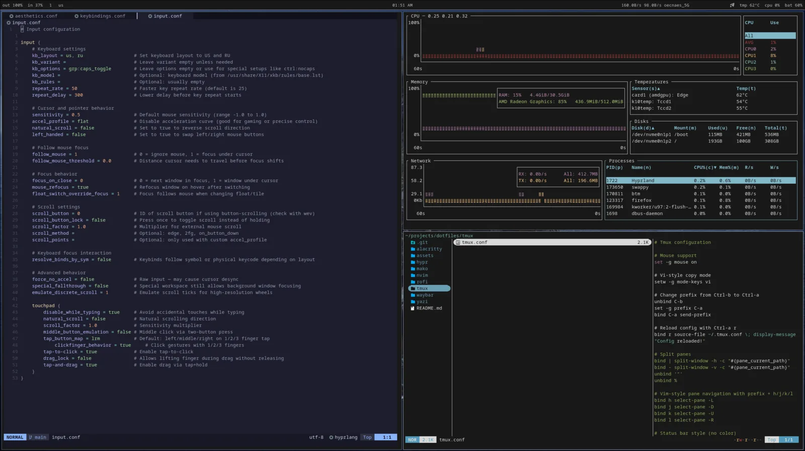
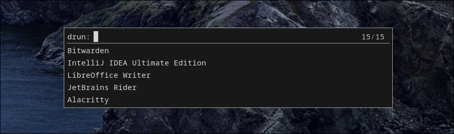
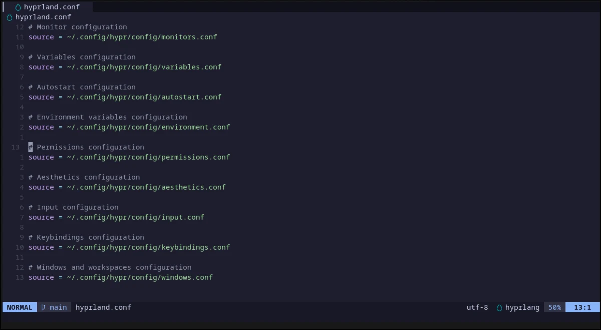

# dotfiles

My Arch Linux + Hyprland setup. Keyboard-first, Wayland-native, low decoration, sharp corners, fast launchers, readable bars, and a terminal workflow that stays out of the way.

These are personal working configs, not a one-command distro. Use them as a map, steal what is useful, and expect to adjust monitor names, package names, paths, and hardware-specific bits.

[](https://archlinux.org/)
[](https://hyprland.org/)
[](https://wayland.freedesktop.org/)
[](https://neovim.io/)
[](https://github.com/tmux/tmux)
[](https://yazi-rs.github.io/)

### Screenshots







### What This Is

- `hypr/` - modular Hyprland config split by monitors, variables, autostart, environment, input, keybindings, windows, and aesthetics.
- `waybar/` - compact top bar for audio, mic, workspace, language, clock, network, tray, temperature, CPU, and battery.
- `nvim/` - Lazy.nvim-based Neovim config with LSP, completion, Treesitter, Telescope, formatting, linting, Git signs, sessions, Oil, Bufferline, and Catppuccin.
- `tmux/` - Ctrl-a prefix, vi copy mode, Wayland clipboard copy, vim-style panes, TPM plugins, and a deliberately boring status line.
- `yazi/` - terminal file manager with size-focused line mode, visible hidden files, PDF text previews, and simple open rules.
- `rofi/` - fuzzy `drun` launcher with a small rectangular layout.
- `alacritty/` - minimal terminal config with live reload, plain monospace font, OSC52 copy, and bash login shell.
- `mako/` - top-right notifications with the same monochrome, square-edged look.

### Desktop Shape

The desktop is built around Hyprland on Wayland with `SUPER` as the main modifier. It favors direct keybindings over menus:

- `SUPER + Return` opens Alacritty.
- `SUPER + D` opens Rofi.
- `SUPER + E` opens Yazi inside Alacritty.
- `SUPER + B` opens Firefox.
- `SUPER + H/J/K/L` moves focus.
- `SUPER + Shift + H/J/K/L` moves windows.
- `SUPER + 1..0` switches workspaces.
- `SUPER + Shift + 1..0` moves windows to workspaces.
- `Print` starts a `grim` + `slurp` + `swappy` screenshot flow.

Workspace rules send terminal work to `1`, browsing to `2`, chat to `3`, and Steam/game windows to `4`. The current monitor rule targets a 2560x1440 240 Hz HDR panel by descriptor and includes a fallback for connector changes.

### Neovim

Neovim is configured as a practical coding editor, not a plugin museum. Lazy.nvim bootstraps plugins and the config is split into `config/` and `plugins/`.

Language tooling currently targets Python, C/C++, Java, Lua, and Bash:

- LSP: `pyright`, `clangd`, `jdtls`, `lua_ls`, `bashls`
- Formatting: Black/isort, clang-format, google-java-format, stylua, shfmt
- Linting: flake8, cpplint, checkstyle, luacheck, shellcheck
- Navigation: Telescope with fzf-native, LSP symbol/search bindings, Oil file editing
- Editing: nvim-cmp, LuaSnip, autopairs, surround, comments, Flash, Treesitter textobjects
- Git: fugitive and gitsigns
- UI: Catppuccin, lualine, bufferline, dashboard, fidget, notify, winbar

### Install Notes

There is no install script on purpose. Machine-specific config should be copied deliberately.

Expected shape:

```text
~/.config/hypr
~/.config/waybar
~/.config/nvim
~/.config/rofi
~/.config/alacritty
~/.config/mako
~/.config/yazi
~/.tmux.conf
```

Example manual links:

```bash
ln -s "$PWD/hypr" ~/.config/hypr
ln -s "$PWD/waybar" ~/.config/waybar
ln -s "$PWD/nvim" ~/.config/nvim
ln -s "$PWD/rofi" ~/.config/rofi
ln -s "$PWD/alacritty" ~/.config/alacritty
ln -s "$PWD/mako" ~/.config/mako
ln -s "$PWD/yazi" ~/.config/yazi
ln -s "$PWD/tmux/tmux.conf" ~/.tmux.conf
```

Adjust before linking:

- `hypr/config/monitors.conf` for your monitor descriptor, resolution, refresh rate, scaling, HDR, and reserved space.
- `hypr/config/variables.conf` for terminal, browser, launcher, file manager, task manager, sound mixer, and wallpaper path.
- `waybar/config` for network interface, thermal zone, and modules.
- `hypr/hyprpaper.conf` for wallpaper path.
- `hypr/config/keybindings.conf` for keyboard backlight device names and brightness controls.

### Packages I Expect

Core desktop pieces:

```text
hyprland hyprpaper hyprpolkitagent waybar rofi alacritty mako tmux yazi firefox
wl-clipboard cliphist grim slurp swappy brightnessctl wireplumber pulsemixer
bottom zathura sxiv file-roller
```

Neovim tooling:

```text
neovim git make ripgrep fd nodejs npm python python-pip jdk-openjdk
black isort flake8 clang clang-tools-extra google-java-format stylua shfmt shellcheck
```

Names vary by distro and package source. This repo assumes Arch habits, not universal portability.

### Opinionated Bits

- Square corners everywhere. Rounded corners look nice; I do not want them here.
- Minimal color outside the editor. The desktop should frame work, not compete with it.
- Master layout first. Most sessions have one important window and several supporting ones.
- Wayland-first environment variables. X11 is fallback, not the default path.
- Neovim and tmux share navigation muscle memory.
- The config is small enough to read. If it gets clever enough to surprise me, it is too clever.

### Not Included

- Secrets, tokens, SSH config, browser profile, package lock for the whole OS, or machine bootstrap script.
- Wallpaper image files.
- A promise that this works unchanged on your laptop.

This is the setup I use because it makes my computer feel like a tool again.
